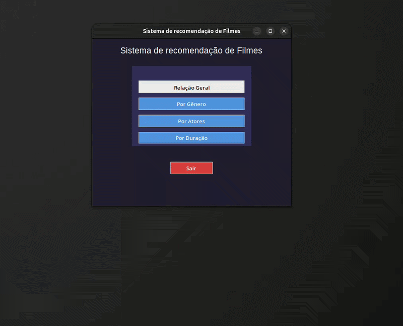
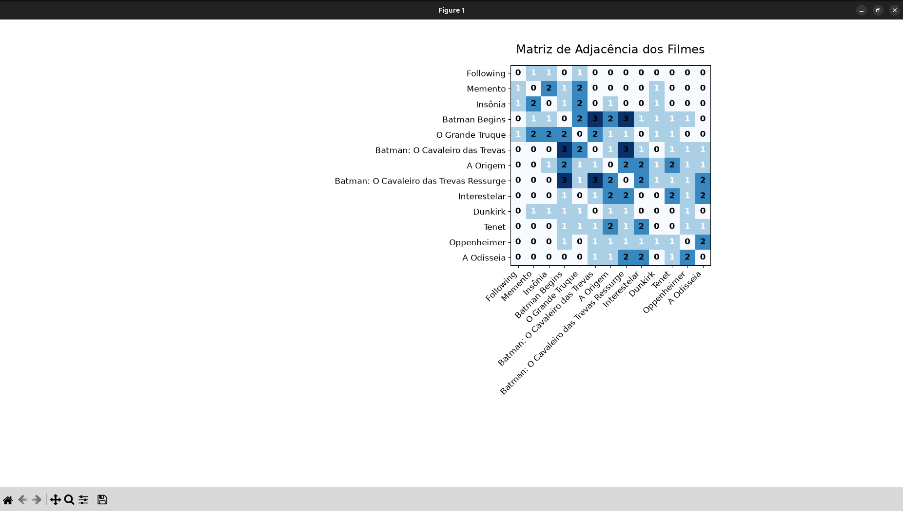
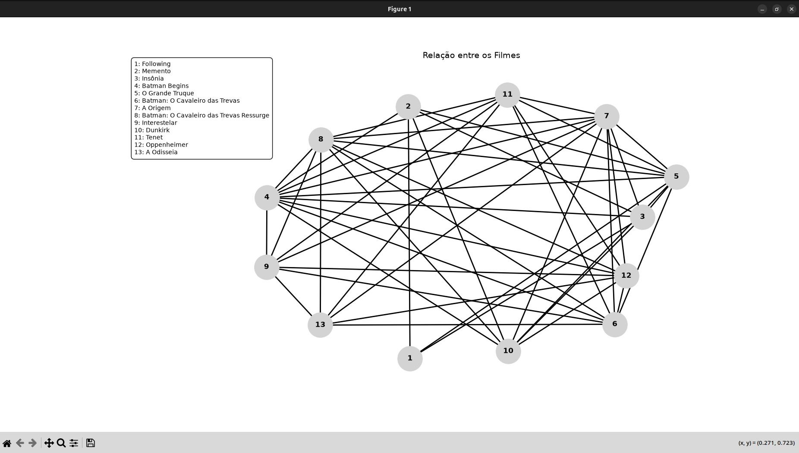

<div align="center">
 
</div>

<h1 align="center">🎬 Sistema de Recomendação de Filmes</h1> 
 
Projeto acadêmico desenvolvido para a disciplina de **Matemática Computacional Aplicada**, com o objetivo de demonstrar a aplicabilidade prática de estruturas matemáticas discretas na construção de um sistema de recomendação de filmes.
 
---
 
## 📋 Sobre o projeto
 
O sistema modela as relações entre filmes a partir de três critérios:
 
- **Gênero** — filmes do mesmo gênero são considerados relacionados;
- **Elenco** — filmes com atores em comum são conectados;
- **Duração** — filmes com diferença de até 30 minutos são agrupados.
<p>Essas relações são representadas por meio de <b>grafos</b> e <b>matrizes de adjacência</b>, e a consistência lógica do modelo é verificada com <b>Lógica Booleana</b> <br>(expressão `R = G ∨ A ∨ D`). O sistema também gera uma visualização ponderada geral, indicando o grau de similaridade entre cada par de filmes com base na quantidade de critérios em comum.</p>
 
---
 
## 🛠️ Tecnologias utilizadas
 
- [Python 3](https://www.python.org/);
- [NetworkX](https://networkx.org/) — criação e manipulação dos grafos;
- [Matplotlib](https://matplotlib.org/) — visualização dos grafos e matrizes;
- [Tkinter](https://docs.python.org/3/library/tkinter.html) — interface gráfica.

# Como executar o projeto

<b>1.</b> Para clonar o repositório na própria máquina:

```bash
git clone https://github.com/MiguelReisB/movie-relator-recommender-system.git
cd movie-relator-recommender-system
```

<b>2.</b> Criar e ativar um ambiente virtual:

**Linux/macOS:**

```bash
python3 -m venv .venv
source .venv/bin/activate
```

**Windows (PowerShell):**

```powershell
python -m venv .venv
.venv\Scripts\activate
```

<b>3.</b> Instalar as dependências do projeto direto do arquivo .txt, sem a necessidade de baixar no seu próprio computador:

```bash
pip install -r requirements.txt
```

<b>4.</b> E enfim, executar a aplicação:

```bash
python main.py
```

<b>5.</b> Ao selecionar alguma opção para visualizar determinada relação entre os filmes, aparecerá primeiro a matriz de adjacência, em seguida, ao fechar a janela no 'x', aparecerá o grafo referente àquela mesma opção selecionada anteriormente. Logo após, fechando novamente no 'x', o sistema retorna automaticamente para a primeira tela. Para sair e encerrar, basta clicar em 'sair' ou novamente no 'x'.

<b>Obs:</b> Para encerrar manualmente a máquina virtual no terminal, execute: 
```bash
deactivate
```
Se preferir, basta apenas fechar o terminal que a máquina virtual será encerrada automaticamente.

## Para melhor visualização...

<p>Busque abrir cada matriz e grafo em tela cheia:</p>


